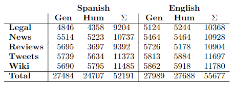
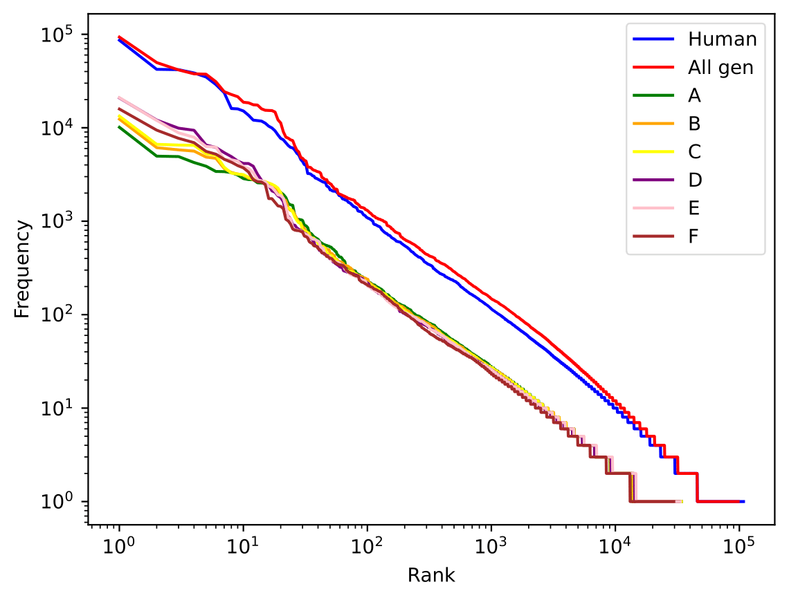
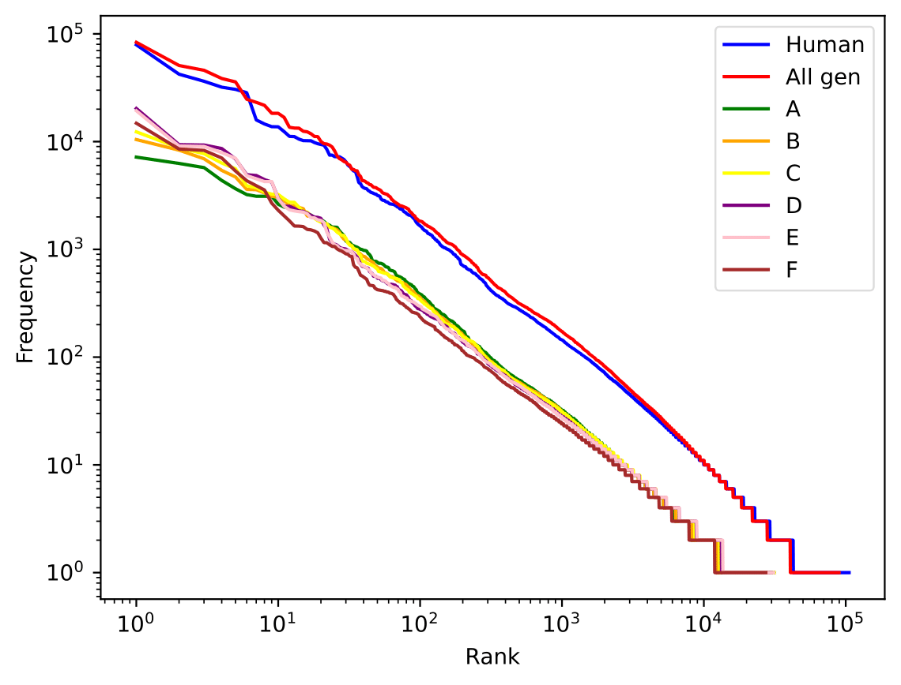
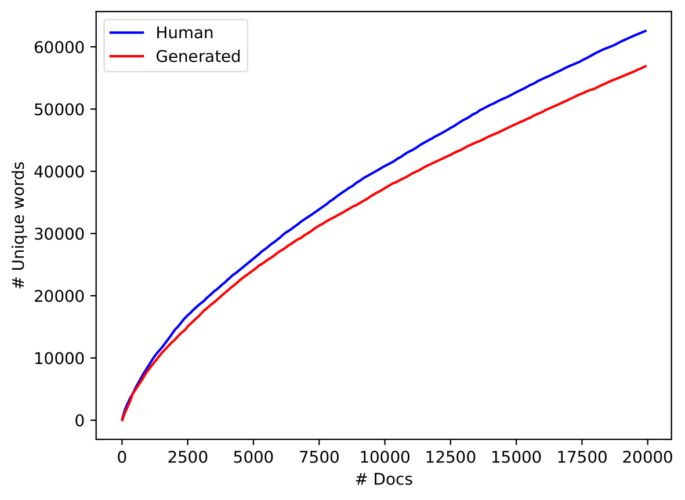
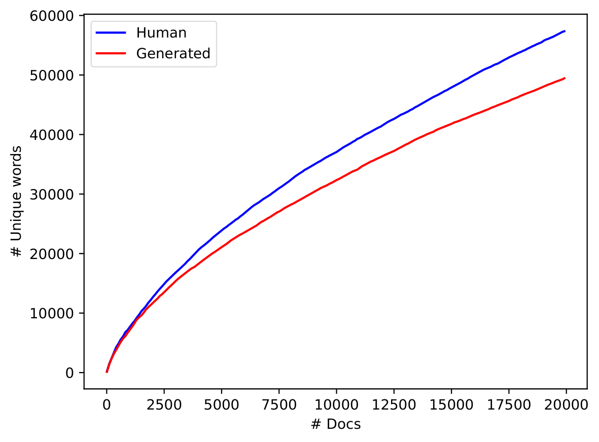

# Dataset (Subtask 1)

## Dataset counts

# Dataset (Subtask 2)

## Dataset counts

# General

## Zipf's Law (Spanish)

## Zipf's law (English)

## Heap's law (Spanish)

## Heap's law (English)

