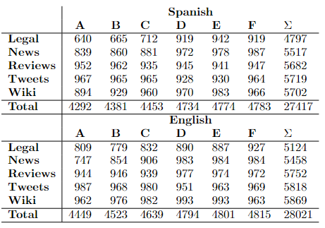

# Dataset (Subtask 1)

## Dataset counts

# Dataset (Subtask 2)

## Dataset counts

# General

## Zipf's Law (Spanish)

## Zipf's law (English)

## Heap's law (Spanish)

## Heap's law (English)

## Metric plots
These plots aim to show the distribution of the generated/human texts according to the different domains/labels/models in terms of metrics that measure the quality of generations and that compare them with the prompts (i.e. repetition, diversity, stopword and symbol ratios, self-BLEU, perplexity, SimCSE semantic coherence, and entailment ratio). Each text is represented with a vector of metric values, normalized with z-score and t-SNE projected using a perplexity of 15, keeping the remaining parameters as default. The three plots contain the same points, but colored according to the different domains, models, and label.

|  | 
|:--:| 
| *Domain plot* |

|  | 
|:--:| 
| *Model plot* |

|  | 
|:--:| 
| *Label plot* |
